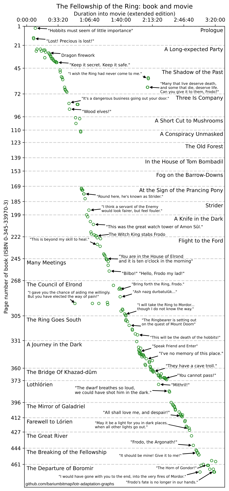

# Graphs representing the book-to-movie adaption of The Lord of the Rings

This is a graph of direct connections between the book and movie adaptation of *The Fellowship of the Ring*, including dialog and visual descriptions. To make it I went through [the movie](https://www.imdb.com/title/tt0120737/) (extended version of course) [and book](https://www.tolkienbooks.us/lotr/us/mmpb/bb2007/the-fellowship-of-the-ring-2007) together, looking for text or visuals that showed up in both. I also used an ebook version of the book to provide full-text search and [some websites](http://www.ageofthering.com/atthemovies/scripts/fellowshipofthering5to8.php) by [LOTR fans](https://www.squidge.org/~praxisters/fellowship/fic/fotrscript.htm) that [had transcribed](https://www.tk421.net/lotr/film/fotr/14.html) the movie. This isn't a fully exhaustive list, but I tried to include at least one entry per page so there wouldn't be gaps in the graph. The resulting data is here:

[Fellowship of the Ring - page-to-timestamp.tsv](./Fellowship of the Ring - chapters.tsv)

And the Jupyter notebook to create the graph is here:

[fellowship-of-the-ring-adaptation-graphs.ipynb](./fellowship-of-the-ring-adaptation-graphs.ipynb)

Final version of the graph:

